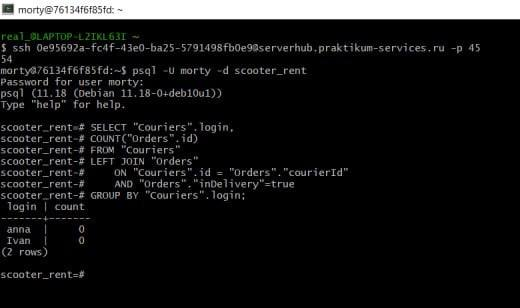

```sql
SELECT "Couriers".login, 
COUNT("Orders".id) 
FROM "Couriers" 
LEFT JOIN "Orders" 
    ON "Couriers".id = "Orders"."courierId" 
    AND "Orders"."inDelivery"=true 
GROUP BY "Couriers".login;

